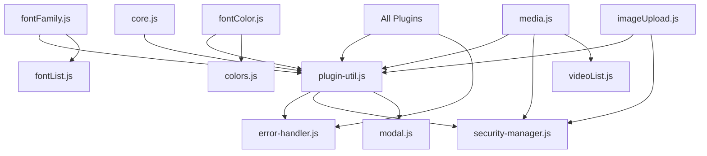

# LiteEditor 전체 기능 및 파일 구조 목록

## 📋 개요

LiteEditor의 모든 JavaScript 파일과 CSS 파일의 역할 및 기능을 체계적으로 정리한 문서입니다.

## 🗂️ 파일 구조
```
lite-editor/
├── js/
│ ├── data/ # 데이터 파일
│ │ ├── colors.js # 색상 팔레트 데이터
│ │ ├── fontList.js # 폰트 목록 데이터
│ │ └── videoList.js # 동영상 도메인 허용 목록
│ ├── plugins/ # 플러그인 파일
│ │ ├── align.js # 텍스트 정렬 (좌/중/우/양쪽)
│ │ ├── bulletList.js # 불릿 목록 생성/편집
│ │ ├── checkList.js # 체크리스트 생성/편집
│ │ ├── codeBlock.js # 코드 블록 삽입/하이라이팅
│ │ ├── highlight.js # 텍스트 배경색 하이라이트
│ │ ├── fontColor.js # 폰트 색상 선택
│ │ ├── fontFamily.js # 폰트 패밀리 선택
│ │ ├── heading.js # 제목 스타일 (H1-H6)
│ │ ├── imageUpload.js # 이미지 업로드/리사이즈
│ │ ├── line.js # 구분선 삽입
│ │ ├── link.js # 하이퍼링크 생성/편집
│ │ ├── media.js # 동영상 삽입/리사이즈
│ │ ├── numberedList.js # 번호 목록 생성/편집
│ │ ├── plugin-util.js # 플러그인 공통 유틸리티
│ │ └── table.js # 테이블 생성/편집
│ ├── core.js # 핵심 엔진 (에디터 초기화/이벤트)
│ ├── error-handler.js # 오류 처리/로깅 시스템
│ ├── loader.js # 파일 동적 로딩 관리
│ ├── modal.js # 모달/레이어 관리
│ └── security-manager.js # 보안 검증/URL 관리
└── css/
├── plugins/ # 플러그인 CSS
│ ├── align.css # 정렬 드롭다운 스타일
│ ├── bulletList.css # 불릿 목록 스타일
│ ├── checkList.css # 체크박스 스타일
│ ├── codeBlock.css # 코드 블록 스타일/하이라이팅
│ ├── highlight.css # 하이라이트 버튼 스타일
│ ├── fontColor.css # 색상 팔레트 스타일
│ ├── fontFamily.css # 폰트 드롭다운 스타일
│ ├── heading.css # 제목 드롭다운 스타일
│ ├── imageUpload.css # 이미지 업로드/리사이즈 스타일
│ ├── line.css # 구분선 스타일
│ ├── link.css # 링크 모달 스타일
│ ├── media.css # 동영상 래퍼/리사이즈 스타일
│ ├── numberedList.css # 번호 목록 스타일
│ ├── plugins.css # 플러그인 공통 스타일
│ └── table.css # 테이블 스타일/컨트롤
├── core.css # 에디터 핵심 스타일 (툴바/콘텐츠)
└── modal.css # 모달 오버레이/박스 스타일

```

## 에디터 툴바의 기능 목록
### 기본 툴바 기능

- bold: { key: 'b', cmd: true },           // ⌘+B / Ctrl+B
- italic: { key: 'i', cmd: true },         // ⌘+I / Ctrl+I  
- underline: { key: 'u', cmd: true },      // ⌘+U / Ctrl+U
- strike: { key: 's', cmd: true, shift: true }, // ⌘+Shift+S / Ctrl+Shift+S

  // 🏷️ 헤딩 (Alt 대신 Cmd+Shift 조합으로 변경)
- heading1: { key: '1', cmd: true, shift: true }, // ⌘+Shift+1
- heading2: { key: '2', cmd: true, shift: true }, // ⌘+Shift+2  
- heading3: { key: '3', cmd: true, shift: true }, // ⌘+Shift+3
- paragraph: { key: '0', cmd: true, shift: true }, // ⌘+Shift+0

  // 🔗 기능 단축키
- link: { key: 'k', cmd: true },           // ⌘+K / Ctrl+K
- image: { key: 'i', cmd: true, shift: true }, // ⌘+Shift+I
- code: { key: 'e', cmd: true },           // ⌘+E / Ctrl+E (E for codE)
- blockquote: { key: 'q', cmd: true, shift: true }, // ⌘+Shift+Q

  // 📋 리스트 (숫자 키 조합으로 직관적)
- bulletList: { key: '8', cmd: true },     // ⌘+8 (• 모양과 유사)
- numberedList: { key: '7', cmd: true },   // ⌘+7 (숫자 목록)
- checkList: { key: '9', cmd: true },      // ⌘+9 (체크리스트)

  // ⬅️➡️ 정렬 (방향키와 유사한 논리)
- alignLeft: { key: 'l', cmd: true, alt: true },    // ⌘+Alt+L
- alignCenter: { key: 'c', cmd: true, alt: true },  // ⌘+Alt+C  
- alignRight: { key: 'r', cmd: true, alt: true },   // ⌘+Alt+R
- alignJustify: { key: 'j', cmd: true, alt: true }, // ⌘+Alt+J

  // 🔄 편집 (현재 동작하는 것들 유지)
- undo: { key: 'z', cmd: true },           // ⌘+Z / Ctrl+Z
- redo: { key: 'z', cmd: true, shift: true }, // ⌘+Shift+Z / Ctrl+Shift+Z
- copy: { key: 'c', cmd: true },           // ⌘+C / Ctrl+C (시스템 기본)
- paste: { key: 'v', cmd: true },          // ⌘+V / Ctrl+V (시스템 기본)
- cut: { key: 'x', cmd: true },            // ⌘+X / Ctrl+X (시스템 기본)
  
  // 📐 들여쓰기 (Tab 키 유지)
- indent: { key: 'Tab' },                  // Tab
- outdent: { key: 'Tab', shift: true },    // Shift+Tab

### 편집 도구 단축키

- undo : 실행 취소 - `⌘+Z` (window: `Ctrl+Z`)
- redo : 재실행 - `⌘+Shift+Z` (window: `Ctrl+Shift+Z`)
- copy : 복사 - `⌘+C` (window: `Ctrl+C`)
- paste : 붙여넣기 - `⌘+V` (window: `Ctrl+V`)
- cut : 잘라내기 - `⌘+X` (Mac: `Ctrl+X`)

## 🔧 Core 시스템 파일

### 1. js/core.js
**역할**: LiteEditor의 핵심 엔진  
**기능**:
- 에디터 초기화 및 설정
- 플러그인 등록 시스템
- 기본 편집 기능 (텍스트 입력, 선택, 복사/붙여넣기)
- 키보드 단축키 처리
- 에디터 이벤트 관리
- DOM 조작 및 콘텐츠 관리

**관련 CSS**: `css/core.css`
- 에디터 기본 스타일
- 툴바 레이아웃
- 콘텐츠 영역 스타일
- 기본 타이포그래피

### 2. js/error-handler.js
**역할**: 통합 오류 처리 및 로깅 시스템  
**기능**:
- 오류 코드 체계 관리
- 컬러 로깅 시스템 (`colorLog`)
- 선택 영역 로깅 (`logSelectionOffsets`)
- 사용자 알림 표시 (`showUserAlert`)
- 디버깅 정보 수집
- 오류 레벨별 분류 (INFO, WARN, ERROR)

**관련 CSS**: 없음 (로깅 전용)

### 3. js/loader.js
**역할**: 파일 동적 로딩 관리  
**기능**:
- JavaScript 파일 순차 로딩
- CSS 파일 로딩
- 의존성 관리
- 로딩 순서 제어
- 로딩 완료 콜백 처리

**로딩 순서**:
```javascript
// 1. 데이터 파일
'js/data/colors.js',
'js/data/fontList.js', 
'js/data/videoList.js',

// 2. 핵심 시스템
'js/error-handler.js',
'js/security-manager.js',
'js/modal.js',

// 3. 플러그인 유틸리티
'js/plugins/plugin-util.js',

// 4. 개별 플러그인들
'js/plugins/align.js',
'js/plugins/fontColor.js',
// ... 기타 플러그인들

// 5. 핵심 엔진 (마지막)
'js/core.js'
```

**관련 CSS**: 없음 (로더 전용)

### 4. js/modal.js
**역할**: 모달 및 레이어 관리 시스템  
**기능**:
- 모달 창 생성 및 관리
- 레이어 우선순위 제어
- 외부 클릭 감지
- ESC 키 처리
- 모달 스택 관리
- 활성 모달 추적

**관련 CSS**: `css/modal.css`
- 모달 오버레이 스타일
- 모달 콘텐츠 박스
- 애니메이션 효과
- z-index 관리

### 5. js/security-manager.js
**역할**: 보안 검증 및 URL 관리  
**기능**:
- URL 유효성 검사 (`isValidUrl`)
- 이미지 URL 검증 (`isValidImageUrl`)
- 동영상 URL 검증 (`isVideoUrlAllowed`)
- 동영상 플랫폼 감지 (`detectVideoPlatform`)
- 임베드 URL 생성 (`createEmbedUrl`)
- 안전한 iframe 생성 (`createSafeIframe`)
- XSS 방지
- 도메인 허용 목록 관리

**지원 플랫폼**:
- YouTube, Vimeo, Wistia, Dailymotion
- 카카오TV, 네이버TV

**관련 CSS**: 없음 (보안 로직 전용)

## 📊 Data 파일

### 1. js/data/colors.js
**역할**: 색상 데이터 관리  
**기능**:
- 폰트 색상 팔레트 정의
- 배경색 팔레트 정의
- 색상 그룹 분류
- 다국어 색상명 지원

**데이터 구조**:
```javascript
LiteEditorColorData = {
  getFontColors: () => [...],
  getBackgroundColors: () => [...]
}
```

### 2. js/data/fontList.js
**역할**: 폰트 목록 데이터 관리  
**기능**:
- 웹 폰트 목록 정의
- 시스템 폰트 목록
- 폰트 그룹 분류
- 폰트 패밀리 값 매핑
- 다국어 폰트명 지원

**데이터 구조**:
```javascript
LiteEditorFontData = {
  getFonts: () => [
    { type: 'group_header', name: '그룹명' },
    { type: 'divider' },
    { name: '폰트명', value: 'font-family 값' }
  ]
}
```

### 3. js/data/videoList.js
**역할**: 동영상 도메인 허용 목록  
**기능**:
- 허용된 동영상 도메인 정의
- 플랫폼별 도메인 분류
- 보안 정책 데이터

**데이터 구조**:
```javascript
LiteEditorVideoData = {
  ALLOWED_VIDEO_DOMAINS: [
    'youtube.com', 'youtu.be',
    'vimeo.com', 'tv.kakao.com',
    'tv.naver.com', 'naver.me'
  ]
}
```

## 🔌 Plugin 시스템

### js/plugins/plugin-util.js
**역할**: 플러그인 공통 유틸리티  
**기능**:
- DOM 조작 유틸리티 (`util.dom`)
- 선택 영역 관리 (`util.selection`)
- 스크롤 위치 보존 (`util.scroll`)
- 스타일 로딩 (`util.styles`)
- 레이어 위치 설정 (`util.layer`)
- 에디터 이벤트 (`util.editor`)
- 활성 모달 관리 (`util.activeModalManager`)
- 외부 클릭 핸들러 (`util.setupOutsideClickHandler`)

**핵심 함수들**:
```javascript
// DOM 유틸리티
util.dom.createElement(tag, attributes, styles)

// 선택 영역 관리
util.selection.saveSelection()
util.selection.restoreSelection(range)
util.selection.normalizeSelectionRange()

// 스크롤 관리
util.scroll.savePosition()
util.scroll.restorePosition(position)
util.scroll.preservePosition(callback)

// 모달 관리
util.activeModalManager.register(modal)
util.activeModalManager.unregister(modal)
util.activeModalManager.closeAll()
```

**관련 CSS**: `css/plugins/plugins.css`
- 공통 플러그인 스타일
- 드롭다운 기본 스타일
- 버튼 공통 스타일

## 📝 텍스트 편집 플러그인

### 1. js/plugins/fontFamily.js
**역할**: 폰트 패밀리 선택  
**기능**:
- 폰트 드롭다운 UI
- 폰트 적용 (`execCommand('fontName')`)
- 커서 위치 보존
- Enter/Shift+Enter 키 처리
- 폰트 영역 관리

**관련 CSS**: `css/plugins/fontFamily.css`
- 폰트 드롭다운 스타일
- 폰트 미리보기
- 호버 효과

### 2. js/plugins/fontColor.js
**역할**: 폰트 색상 선택  
**기능**:
- 색상 팔레트 UI
- 색상 적용 (`execCommand('foreColor')`)
- 색상 그룹 표시
- 최근 사용 색상

**관련 CSS**: `css/plugins/fontColor.css`
- 색상 팔레트 레이아웃
- 색상 칩 스타일
- 그룹 헤더 스타일

### 3. js/plugins/highlight.js
**역할**: 텍스트 배경색 하이라이트  
**기능**:
- 텍스트 배경색 하이라이트 적용
- 토글 상태 관리


### 4. js/plugins/heading.js
**역할**: 제목 스타일 적용  
**기능**:
- H1~H6 제목 태그 적용
- 제목 드롭다운 UI
- 블록 레벨 변환

**관련 CSS**: `css/plugins/heading.css`
- 제목 드롭다운 스타일
- 제목 미리보기

### 5. js/plugins/align.js
**역할**: 텍스트 정렬  
**기능**:
- 좌측 정렬 (`execCommand('justifyLeft')`)
- 중앙 정렬 (`execCommand('justifyCenter')`)
- 우측 정렬 (`execCommand('justifyRight')`)
- 양쪽 정렬 (`execCommand('justifyFull')`)

**관련 CSS**: `css/plugins/align.css`
- 정렬 드롭다운 스타일
- 정렬 아이콘

## 📋 목록 플러그인

### 1. js/plugins/bulletList.js
**역할**: 불릿 목록 생성  
**기능**:
- 불릿 목록 생성/해제
- 중첩 목록 지원
- 들여쓰기/내어쓰기
- Tab/Shift+Tab 처리

**관련 CSS**: `css/plugins/bulletList.css`
- 불릿 스타일
- 들여쓰기 스타일

### 2. js/plugins/numberedList.js
**역할**: 번호 목록 생성  
**기능**:
- 번호 목록 생성/해제
- 중첩 번호 목록
- 번호 스타일 관리
- 자동 번호 증가

**관련 CSS**: `css/plugins/numberedList.css`
- 번호 스타일
- 중첩 목록 스타일

### 3. js/plugins/checkList.js
**역할**: 체크리스트 생성  
**기능**:
- 체크박스 목록 생성
- 체크 상태 토글
- 체크박스 스타일링
- 키보드 네비게이션

**관련 CSS**: `css/plugins/checkList.css`
- 체크박스 스타일
- 체크 상태 표시
- 리스트 아이템 스타일

## 🎨 미디어 플러그인

### 1. js/plugins/imageUpload.js
**역할**: 이미지 업로드 및 관리  
**기능**:
- 이미지 URL 삽입
- 파일 업로드
- 이미지 리사이즈
- 드래그 앤 드롭
- 복사/붙여넣기
- 이미지 선택 관리

**관련 CSS**: `css/plugins/imageUpload.css`
- 이미지 래퍼 스타일
- 리사이즈 핸들
- 모달 스타일
- 드래그 피드백

### 2. js/plugins/media.js
**역할**: 동영상 삽입 및 관리  
**기능**:
- 다중 플랫폼 동영상 지원
- 동영상 URL 검증
- 동영상 리사이즈
- 보안 검증 통합
- 플랫폼별 임베드 생성

**지원 플랫폼**:
- YouTube, Vimeo, Wistia
- Dailymotion, 카카오TV, 네이버TV

**관련 CSS**: `css/plugins/media.css`
- 동영상 래퍼 스타일
- 리사이즈 핸들
- 드롭다운 스타일

### 3. js/plugins/link.js
**역할**: 하이퍼링크 생성 및 관리  
**기능**:
- 링크 생성 (`execCommand('createLink')`)
- 링크 편집
- 링크 제거
- URL 유효성 검사
- 새 창 열기 옵션

**관련 CSS**: `css/plugins/link.css`
- 링크 모달 스타일
- 링크 입력 폼
- 링크 미리보기

## 🔧 구조 플러그인

### 1. js/plugins/table.js
**역할**: 테이블 생성 및 편집  
**기능**:
- 테이블 생성
- 행/열 추가/삭제
- 셀 병합/분할
- 테이블 스타일링
- 테이블 리사이즈

**관련 CSS**: `css/plugins/table.css`
- 테이블 기본 스타일
- 테이블 컨트롤
- 셀 선택 표시

### 2. js/plugins/line.js
**역할**: 구분선 삽입  
**기능**:
- 수평선 삽입 (`<hr>`)
- 다양한 선 스타일
- 선 두께 조절
- 선 색상 변경

**관련 CSS**: `css/plugins/line.css`
- 구분선 스타일
- 선 변형 효과

### 3. js/plugins/codeBlock.js
**역할**: 코드 블록 생성  
**기능**:
- 코드 블록 생성
- 문법 하이라이팅
- 언어 선택
- 코드 복사 기능
- 들여쓰기 관리

**관련 CSS**: `css/plugins/codeBlock.css`
- 코드 블록 스타일
- 문법 하이라이팅
- 코드 폰트 설정

## 🔗 의존성 관계



## 📋 CSS 파일 전체 목록

### Core CSS
- `css/core.css` - 에디터 핵심 스타일
- `css/modal.css` - 모달 시스템 스타일

### Plugin CSS
- `css/plugins/plugins.css` - 플러그인 공통 스타일
- `css/plugins/align.css` - 정렬 플러그인
- `css/plugins/bulletList.css` - 불릿 목록
- `css/plugins/checkList.css` - 체크리스트
- `css/plugins/codeBlock.css` - 코드 블록
- `css/plugins/fontColor.css` - 폰트 색상
- `css/plugins/fontFamily.css` - 폰트 패밀리
- `css/plugins/heading.css` - 제목 스타일
- `css/plugins/imageUpload.css` - 이미지 업로드
- `css/plugins/line.css` - 구분선
- `css/plugins/link.css` - 하이퍼링크
- `css/plugins/media.css` - 동영상 미디어
- `css/plugins/numberedList.css` - 번호 목록
- `css/plugins/table.css` - 테이블

## 🚀 로딩 순서 및 초기화

1. **데이터 파일 로드**: colors.js, fontList.js, videoList.js
2. **시스템 파일 로드**: error-handler.js, security-manager.js, modal.js
3. **유틸리티 로드**: plugin-util.js
4. **플러그인 로드**: 모든 플러그인 파일들
5. **핵심 엔진 로드**: core.js (마지막)
6. **CSS 로드**: 각 플러그인별 CSS 동적 로드

---

**작성일**: 2025-05-25  
**작성자**: LiteEditor 개발팀  
**버전**: 1.0.0  
**총 파일 수**: JavaScript 20개, CSS 17개 